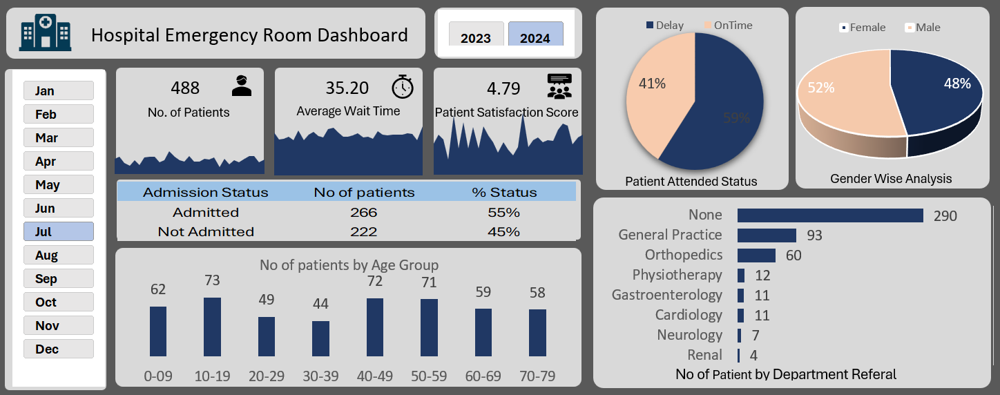

# 📊 Hospital-Emergency-Room-Data-Analysis (Excel Project) 

## 📌 Project Overview
This project analyzes **customer service performance** data using Excel. It evaluates satisfaction scores, wait times, and daywise patterns to highlight operational efficiency and customer experience trends. Pivot reports and dashboards are used to transform raw data into actionable insights.

---

## 🗂️ Project Structure
- **Pivot Report**  
  Aggregated view of KPIs and metrics for satisfaction, wait times, and service performance.

- **Dashboard**  
  Visual summary of customer satisfaction and service efficiency metrics.

- **Satisfaction Scores Daily Trend**  
  Tracks how customer satisfaction scores change over time.

- **Average Wait Time Daily Trend**  
  Monitors wait times across days to identify service delays or improvements.

- **Daywise Analysis**  
  Provides detailed breakdown of service data by day for deeper insights.

---

## ⚙️ Technologies Used
- **Microsoft Excel**  
  - Pivot Tables  
  - Charts & Graphs  
  - Dashboard visualization  

---

## 🚀 How to Use
1. Open the Excel file in Microsoft Excel.  
2. Review the **Pivot Report** for summary metrics.  
3. Explore **Daily Trends** for satisfaction and wait times.  
4. Navigate to the **Dashboard** for visual insights.  

---

## 📊 Sample Dashboard
Example visualization of customer service performance:  

  

---

## 📊 Key Insights
- **Satisfaction trends** reveal changes in customer experience.  
- **Wait time analysis** highlights operational bottlenecks.  
- **Daywise breakdown** helps track service consistency.  
- Dashboards make insights easy to interpret and present.  

---

## 📝 Author
Developed by **[Your Name]**  
An Excel-based analysis project focusing on customer satisfaction and operational efficiency.

